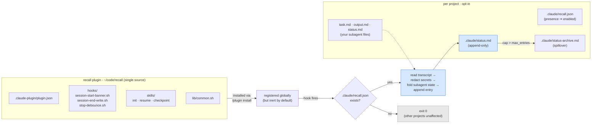
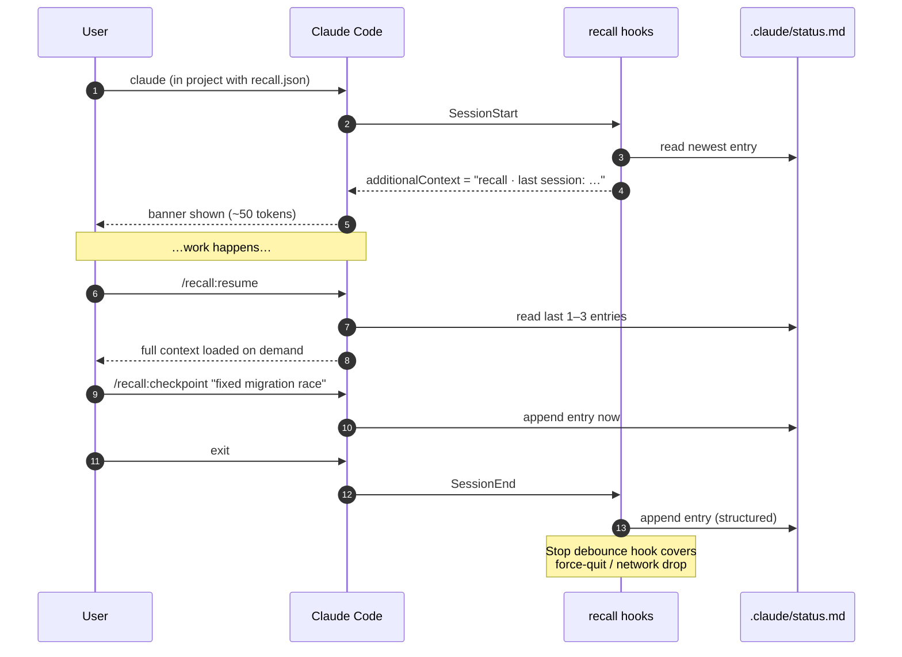
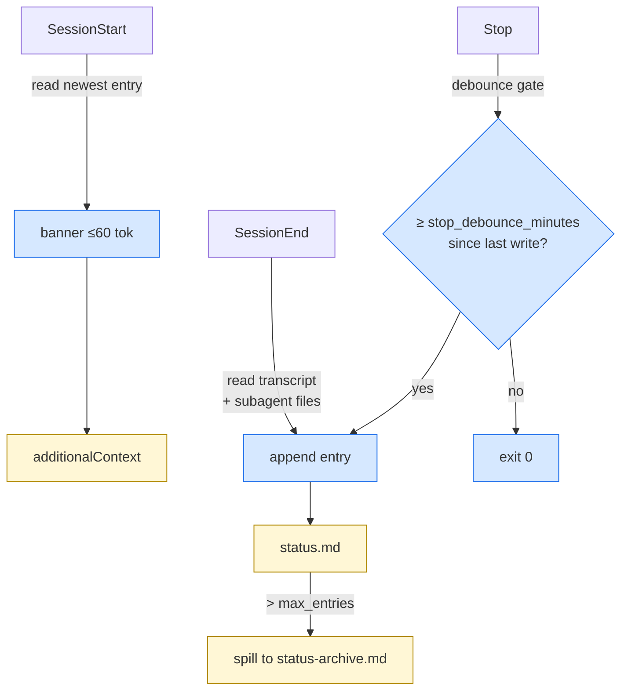

<div align="center">

# ◆ recall

**Resumable session memory for Claude Code — file-based, opt-in, zero LLM cost.**

[](./LICENSE)
[](https://github.com/tonimaxx/recall/actions/workflows/ci.yml)
[](https://code.claude.com/docs/en/plugins)
[](./CHANGELOG.md)

</div>

---

## ▾ TL;DR

▸ **What** — a Claude Code plugin that writes a structured log of each session to `.claude/status.md` and lets you resume on demand.
▸ **Why** — keep continuity across sessions without paying token cost on every start, without an opaque SQLite memory, without a background worker, and without competing with your existing `task.md`/`output.md` subagent files.
▸ **How** — install once, opt in per project with `/recall:init`, work normally, type `/recall:resume` when you want to pick up where you left off.

```bash
# install (once, from your shell — fully automated)
curl -fsSL https://raw.githubusercontent.com/tonimaxx/recall/main/install.sh | bash
```

```text
# enable in a project (once per project, from inside Claude Code)
cd ~/my-project
/recall:init
```

That's it. SessionEnd writes `.claude/status.md`. SessionStart shows a one-line banner. Everything else is opt-in.

---

## ◇ Architecture



▸ **Plugin** lives in one place; updates propagate everywhere.
▸ **Inert mode** — without `.claude/recall.json` in a project, every hook short-circuits in microseconds. The plugin is invisible.
▸ **Active mode** — with the marker, hooks read the session transcript, redact configured patterns, fold tails of your subagent files, and append a structured entry.

---

## ◇ Lifecycle



---

## ◇ Why recall instead of …

| Tool | Mechanism | Cost | Differentiator |
|---|---|---|---|
| **recall** *(this)* | shell hooks → `.claude/status.md` | $0, no runtime | deliberate, file-based, integrates with `task.md` / `output.md` |
| [claude-mem](https://docs.claude-mem.ai/) | 5 hooks + bg worker on :37777 + SQLite | API tokens for AI summaries on every Stop | global by default; opaque DB; auto-summarized |
| [b17z/sage](https://github.com/b17z/sage) | MCP server + skills + plugin | API tokens; runtime | semantic / Obsidian-style, more academic-research shaped |
| [sinzin91/claude-checkpoint](https://www.claudepluginhub.com/plugins/sinzin91-claude-checkpoint) | manual `/checkpoint` `/restore` | $0 | manual only, stores in `/tmp` |
| Native `/rewind` | built-in | $0 | rolls back **file edits**, not session memory |

recall's pitch in one sentence: *"What if my own deliberately-written `status.md` got auto-appended on every session end, and a one-line banner reminded me on session start, with zero LLM in the loop?"*

---

## ◆ Install

### Option A — one-line installer *(recommended)*

```bash
curl -fsSL https://raw.githubusercontent.com/tonimaxx/recall/main/install.sh | bash
```

Writes the marketplace + enables the plugin in `~/.claude/settings.json` directly. No manual `/plugin marketplace add` or `/plugin install` needed. Restart Claude Code (or run `/reload-plugins` in an active session) and the skills appear.

To remove later:

```bash
curl -fsSL https://raw.githubusercontent.com/tonimaxx/recall/main/uninstall.sh | bash
```

### Option B — manual via `/plugin`

```text
/plugin marketplace add tonimaxx/recall
/plugin install recall@recall
/reload-plugins
```

### Option C — `--plugin-dir` for one session *(testing without installing)*

```bash
git clone https://github.com/tonimaxx/recall.git ~/code/recall
claude --plugin-dir ~/code/recall
```

After install, verify with `/help` — you should see `/recall:init`, `/recall:resume`, `/recall:checkpoint`. If skills don't appear, clear the cache: `rm -rf ~/.claude/plugins/cache && /reload-plugins`.

---

## ◆ Per-project enablement

recall is installed globally but **does nothing** until you opt a project in.

```text
cd ~/Desktop/projects/my-app
/recall:init
```

This creates two files inside the project's `.claude/`:

```
.claude/
├── recall.json     # config (the marker that enables hooks)
└── status.md       # log file with header
```

From that point on, every session in this project:

- ✱ writes a structured entry on `SessionEnd` (and as a debounced fallback on `Stop`)
- ✱ injects a one-line banner on `SessionStart`

To turn the project off again — delete `recall.json`. Hooks go inert; nothing else changes.

### Fresh-session escape hatch

Need a clean slate without disabling the plugin?

```bash
CLAUDE_NO_RESUME=1 claude
```

The banner is suppressed and the writer skips this session entirely.

---

## ◆ Commands

| Command | Purpose |
|---|---|
| `/recall:init` | Opt the current project in — writes `.claude/recall.json` and a fresh `.claude/status.md`. |
| `/recall:resume` | Read the latest 1–3 entries from `status.md` and load them as context. Pass a number for more (`/recall:resume 5`, capped at 10). |
| `/recall:checkpoint [note]` | Manually capture a checkpoint mid-session. Optional note becomes the entry's "Note from user" field. |

---

## ◆ Configuration reference

`.claude/recall.json` — created by `/recall:init`. All keys are optional; defaults are sensible.

| Key | Type | Default | Purpose |
|---|---|---|---|
| `max_entries` | int | `20` | Cap on `## ` entries in `status.md` before older ones spill into `status-archive.md`. |
| `banner_max_tokens` | int | `60` | Soft cap on the SessionStart banner length (rough byte estimate). |
| `stop_debounce_minutes` | int | `10` | Minimum gap between Stop-hook writes. SessionEnd writes always run. |
| `include_git_state` | bool | `true` | Add `git: <branch> @ <hash> (clean\|dirty)` line to each entry. |
| `include_subagent_files` | string[] | `["status.md", "task.md", "output.md"]` | Files in project root whose last 8 lines get folded into each entry. |
| `redact_patterns` | string[] | common API-key envs | Names matched as `NAME=value` or `NAME: value` are replaced with `NAME=[REDACTED]`. Bearer tokens and `sk-…` / `ghp_…` patterns are always redacted. |

Override globally via env vars:

| Env | Effect |
|---|---|
| `CLAUDE_NO_RESUME=1` | Suppress banner + writer for this invocation. |
| `RECALL_DEBUG=1` | Verbose hook tracing to stderr (visible in `claude --debug`). |

---

## ◆ `status.md` format

```markdown
# Session log — my-app

> Append-only log written by **recall**. Newest entries at the top.

## 2026-05-01 16:42 PDT — my-app _(via SessionEnd)_

- git: main @ 8c4f1a2 (dirty)
- **Recent turns:**
    user: can we deploy to staging?
    assistant: Migration applied. Branch staging at 8c4f1a2.
- **Subagent state:**
  - **task.md** (last 8 lines):
    - Apply migration 0042
    - Smoke test endpoints
  - **output.md** (last 8 lines):
    - Migration applied at 16:41 PDT
    - 3/3 endpoints OK
```

Human-readable. Greppable. Diffable. Commit-friendly.

---

## ◇ Hook reference



| Event | Script | Behavior |
|---|---|---|
| `SessionStart` | `hooks/session-start-banner.sh` | Reads newest `## ` entry, emits structured `additionalContext` JSON. Idempotent. |
| `SessionEnd` | `hooks/session-end-write.sh` | Reads transcript via `transcript_path`, redacts, composes entry, prepends to `status.md`. |
| `Stop` | `hooks/stop-debounce.sh` | Same writer as SessionEnd, but gated by `stop_debounce_minutes`. Catches abnormal exits. |

All three hooks **exit 0 silently** when:
- `.claude/recall.json` is absent in the active project, or
- `CLAUDE_NO_RESUME=1` is set.

---

## ◆ Privacy & redaction

recall runs **fully offline**. No network calls. No telemetry. No "anonymous usage stats."

Redaction happens before anything is written:

▸ **Default patterns** (always redacted):
`OLLAMA_API_KEY`, `OPENAI_API_KEY`, `ANTHROPIC_API_KEY`, `BOT_TOKEN`, `TELEGRAM_TOKEN`, `NOTIFY_BOT_TOKEN`, `AWS_SECRET_ACCESS_KEY`, `AWS_ACCESS_KEY_ID`, `GH_TOKEN`, `GITHUB_TOKEN`

▸ **Bearer tokens** — `Authorization: Bearer …` always becomes `Bearer [REDACTED]`.

▸ **Provider key prefixes** — anything matching `sk-…`, `ghp_…`, or `github_pat_…` (16+ chars) is redacted regardless of variable name.

▸ **Project additions** — extend via `redact_patterns` in `recall.json`.

> Redaction is best-effort, pattern-based. Don't paste secrets into chat assuming recall will catch every shape. The right place for secrets is `.env`.

---

## ◇ FAQ

**Does this cost API tokens?**
No. recall never calls Claude or any other LLM. The banner is plain text generated by shell.

**Does it conflict with claude-mem / sage / other memory plugins?**
No. They write to their own stores. recall writes to `.claude/status.md`. They can coexist; we just think you don't need both.

**Does the banner show up in projects I haven't enabled?**
No. Without `.claude/recall.json` the hook exits in microseconds — no banner, no log.

**What if `SessionEnd` doesn't fire?**
Force-quit, OOM, network drop, etc. The Stop hook fires throughout the session and writes (debounced) so you get something even when the end is abnormal.

**Multi-machine sync?**
Commit `.claude/status.md` to your project repo. It's plain markdown — diffs cleanly, merges with normal conflict resolution. `.claude/recall.json` can also be committed (it has no secrets).

**Does it slow down session start?**
Banner generation is one `awk` over a small file plus one `jq` call. Single-digit milliseconds.

**Why no LLM-summarization?**
Three reasons: cost, opacity, drift. Your manually-written status entries (`/recall:checkpoint`) are higher signal than any auto-summary, and the SessionEnd entry is mechanical (transcript tail + git state + subagent file tails) — no model needed.

---

## ◆ Local development

```bash
git clone https://github.com/tonimaxx/recall.git
cd recall
brew install jq shellcheck

# offline test against synthetic transcript
bash tests/smoke.sh

# load into a real project for live testing
claude --plugin-dir "$(pwd)"
```

In a Claude Code session loaded with `--plugin-dir`, run `/reload-plugins` to pick up changes without restarting.

CI runs the same `tests/smoke.sh` on every push — see [`.github/workflows/ci.yml`](.github/workflows/ci.yml).

---

## ◇ Roadmap

▸ **Out of scope, deliberately:** LLM summarization, telemetry, non-shell runtimes, cross-project memory aggregation.

▸ **Maybe later:** structured `--json` reader for `status.md` (so other tools can parse), Windows support (currently macOS/Linux only — `bash` + `jq` + `python3` required), per-subagent entry namespacing.

See [CHANGELOG](./CHANGELOG.md) for what's shipped.

---

## ◆ License

MIT — see [LICENSE](./LICENSE). Use it, fork it, ship it.

---

<div align="center">

▸ Built for [Claude Code](https://code.claude.com) ▸ [Issues](https://github.com/tonimaxx/recall/issues) ▸ [Changelog](./CHANGELOG.md) ▸ [Contributing](./CONTRIBUTING.md)

</div>
